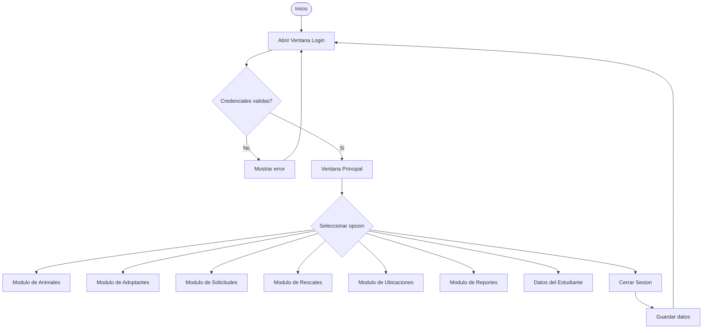

```mermaid
flowchart TD
    A([Inicio]) --> B["Abrir Ventana Login"]
    B --> C{"Credenciales validas?"}
    C -->|No| D["Mostrar error"]
    D --> B
    C -->|Si| E["Ventana Principal"]
    E --> F{"Seleccionar opcion"}
    F --> G["Modulo de Animales"]
    F --> H["Modulo de Adoptantes"]
    F --> I["Modulo de Solicitudes"]
    F --> J["Modulo de Rescates"]
    F --> K["Modulo de Ubicaciones"]
    F --> L["Modulo de Reportes"]
    F --> M["Datos del Estudiante"]
    F --> N["Cerrar Sesion"]
    N --> O["Guardar datos"]
    O --> B
```
