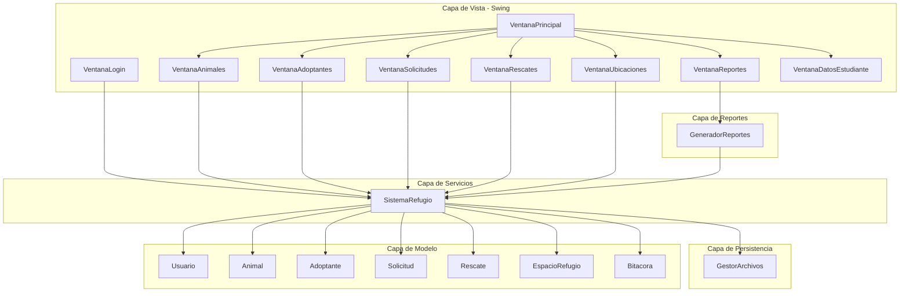

```mermaid
flowchart TB
    subgraph Vista [Capa de Vista - Swing]
        V1[VentanaLogin]
        V2[VentanaPrincipal]
        V3[VentanaAnimales]
        V4[VentanaAdoptantes]
        V5[VentanaSolicitudes]
        V6[VentanaRescates]
        V7[VentanaUbicaciones]
        V8[VentanaReportes]
        V9[VentanaDatosEstudiante]
    end

    subgraph Servicios [Capa de Servicios]
        S1[SistemaRefugio]
    end

    subgraph Persistencia [Capa de Persistencia]
        P1[GestorArchivos]
    end

    subgraph Reportes [Capa de Reportes]
        R1[GeneradorReportes]
    end

    subgraph Modelo [Capa de Modelo]
        M1[Usuario]
        M2[Animal]
        M3[Adoptante]
        M4[Solicitud]
        M5[Rescate]
        M6[EspacioRefugio]
        M7[Bitacora]
    end

    V1 --> S1
    V2 --> V3
    V2 --> V4
    V2 --> V5
    V2 --> V6
    V2 --> V7
    V2 --> V8
    V2 --> V9
    V3 --> S1
    V4 --> S1
    V5 --> S1
    V6 --> S1
    V7 --> S1
    V8 --> R1
    S1 --> M1
    S1 --> M2
    S1 --> M3
    S1 --> M4
    S1 --> M5
    S1 --> M6
    S1 --> M7
    S1 --> P1
    R1 --> S1
```
